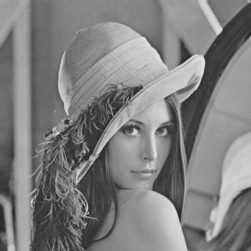
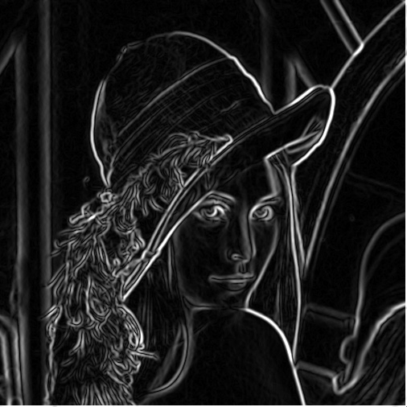
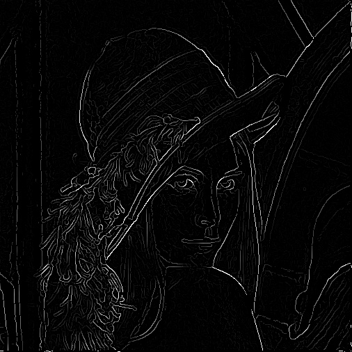
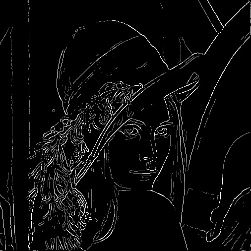
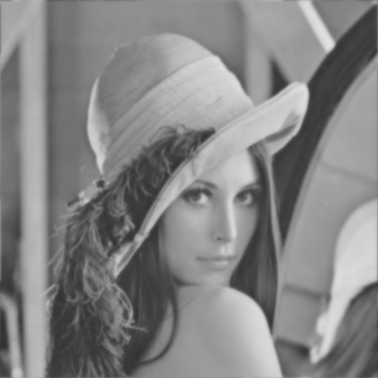
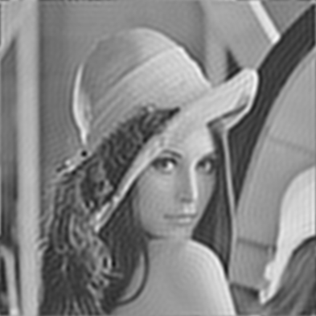

Computer Vision
===============

The main purpose has been to try and implement some of the more common functions where you would normally just use e.g. OpenCV, and through this way get better at programming and get a better understanding of the algorithms

**Table of Contents**
- [Canny Edge Detector](#canny-edge-detector)
- [Frequency Domain Filtering](#frequency-domain-filtering)

Canny Edge Detector
-------------------

As a small challenge I started implementing a Canny Edge Detector without use of any of the built-in OpenCV functions, except for
accessing pixel values. Currently it is not fully complete, as it misses the last step of finding the connected-components and remove all weak edges. the project has however been put on hold for some time now, due to time-constraints.

Image after grayscale conversion          | Gaussian blur with σ = 1.4 and radius = 3
:-------------------------:|:-------------------------:
  | 

Gradient magnitude after Sobel             | Non-maximum suppression | Double threshold with tmin = 40 and tmax = 100
:-------------------------:|:-------------------------:|:-------------------------:
  |  |  

Frequency Domain Filtering
--------------------------

As a mini-project for one of my 8th semester courses I have tried implementing a 2D Discrete Fourier Transform (DFT), as well as a set of spatial and frequency domain filters, allowing image filtering in both the spatial and the frequency domain. This was done primarily without OpenCV functions, in C++. The following filters is currently implemented:

-   Ideal low-, band- and high-pass filter - (Frequency domain)

-   Butterworth low-, band and high-pass filter - (Frequency domain)

-   Mask filter - (Frequency domain)

-   Gaussian blur filter - (Spatial domain)

-   Mean blur filter - (Spatial domain)

-   Sobel edge detector - (Spatial domain)

You can see the effect of the ideal and Butterworth low pass filters below, showing that the Butterworth, unlike the ideal filter, causes no ringing. The cut-off frequency was set to 0.2 in a range from 0 − 1.

Low-pass Butterworth filter          | Ideal low-pass filter
:-------------------------:|:-------------------------:
  | 
